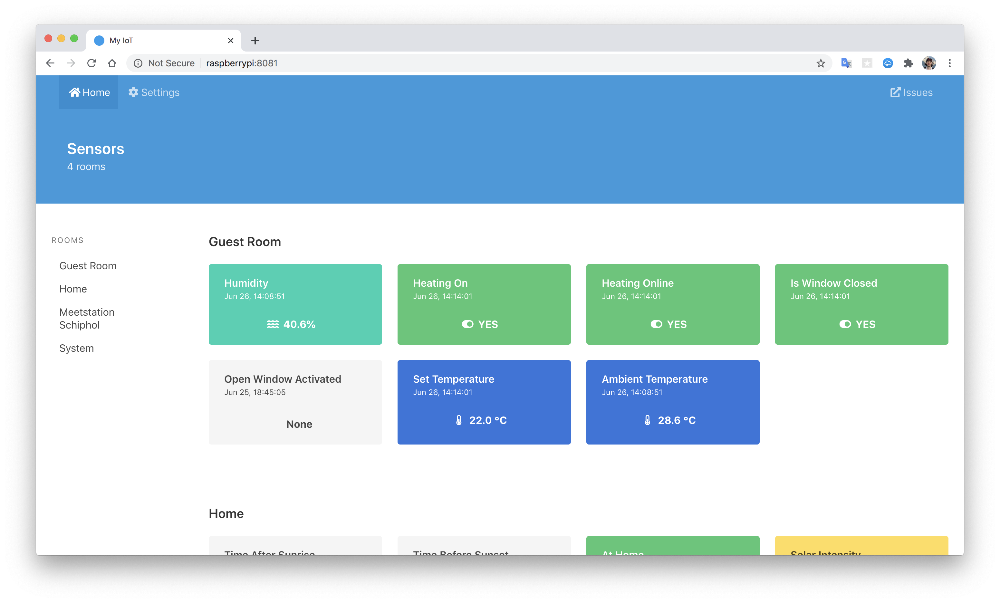
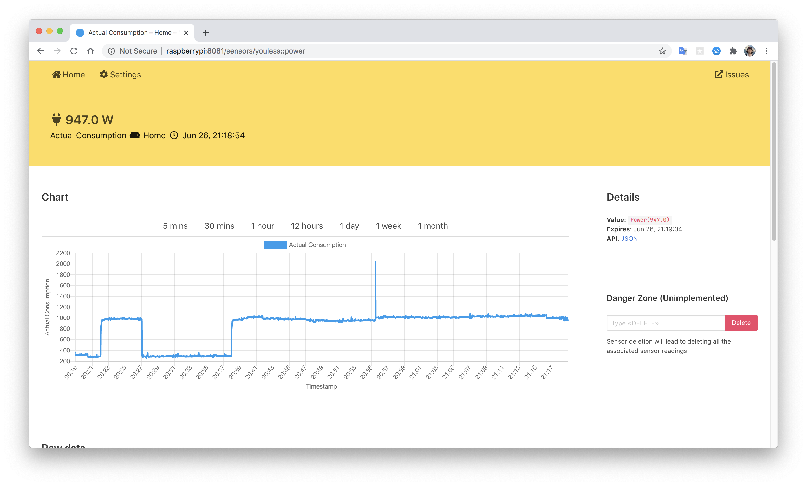
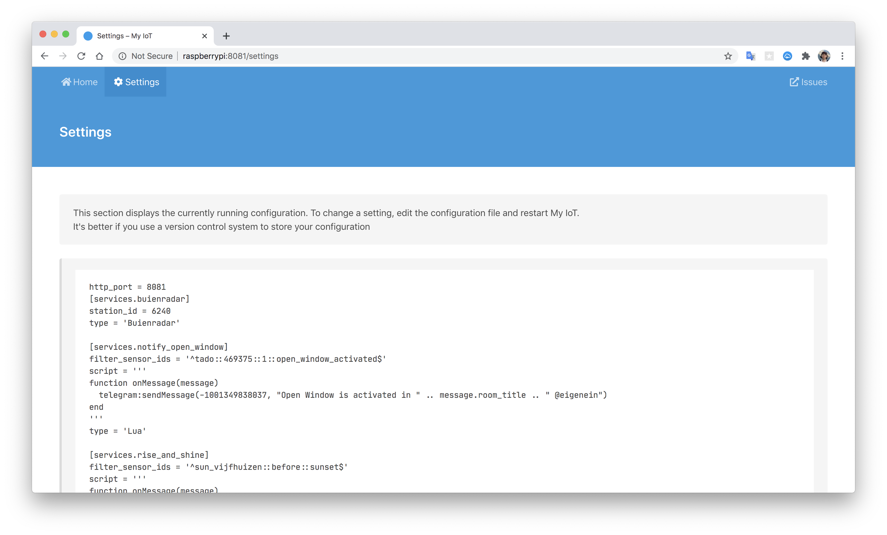
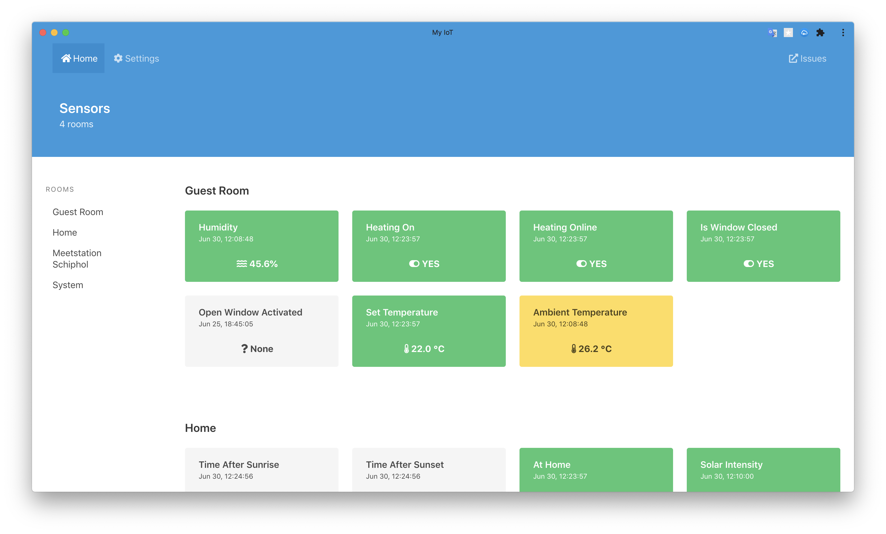
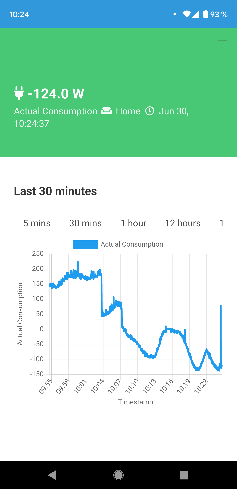

# My IoT

Yet another [home automation](https://en.wikipedia.org/wiki/Home_automation). Written in [Rust](https://www.rust-lang.org/).

## Screenshots

### Home View

### Sensor View

### Settings View

### [Progressive Web App](https://en.wikipedia.org/wiki/Progressive_web_application)

| Desktop                         | Mobile                                |
|---------------------------------|---------------------------------------|
|  |  |
